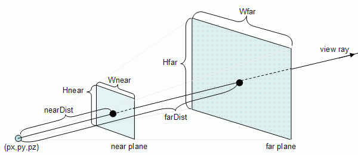

ofCamera provides a camera onto a 3D scene. Some of the different properties of the camera are shown in the picture below:

The far and near clip planes are the boundaries of what's visible in the camera. If you need more information on these, check http://www.falloutsoftware.com/tutorials/gl/gl0.htm
