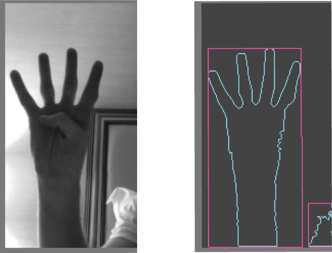

ofxCvBlob represents an area identified by the OpenCV plug-in as being a contiguous object in the scene. It's most often stored within a contrountFind instance and populated by a call to findContours().

In the image below you can see two blobs detected in the grayscale image:

