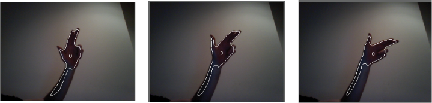

The contour finder allows you to detect objects in a scene by looking at contrast between adjoining pixels. For instance, in the image below, the hand is visible and trackable because the contrast between the wall behind it and the arm is quite distinct:



You can make contour detection more robust by comparing the current image to a background image and subtracting the background from the current image. This enables you to examine the incoming image without the background image data, reducing the amount of data that needs to be inspected.

The contourFinder requires an ofxCvGrayscaleImage be passed to it, so you'll need to create one from either a video or camera feed that you're using. An example of working with a camera is shown here.

In your ofApp header file:

```{.h}
#pragma once

#include "ofMain.h"
#include "ofxOpenCv.h"

class ofApp : public ofBaseApp{

	public:
		void setup();
		void update();
		void draw();
		void keyPressed(int key);
		
		bool bLearnBackground;
		ofVideoGrabber vidGrabber;
		ofxCvColorImage colorImg;
		ofxCvGrayscaleImage grayImage, grayBg, grayDiff;
		ofxCvContourFinder contourFinder;
};
```

In your ofApp.cpp file: 
```cpp
#include "ofApp.h"

void ofApp::setup(){
    
    bLearnBackground = false;
    
    vidGrabber.setVerbose(true);
    vidGrabber.initGrabber(320,240);
    
    colorImg.allocate(320,240);
    grayImage.allocate(320,240);
    grayBg.allocate(320,240);
    grayDiff.allocate(320,240);
}

void ofApp::update(){
    vidGrabber.update();
    //do we have a new frame?
    if (vidGrabber.isFrameNew()){
        colorImg.setFromPixels(vidGrabber.getPixels());
        grayImage = colorImg; // convert our color image to a grayscale image
        if (bLearnBackground == true) {
            grayBg = grayImage; // update the background image
            bLearnBackground = false;
        }
        grayDiff.absDiff(grayBg, grayImage);
        grayDiff.threshold(30);
        contourFinder.findContours(grayDiff, 5, (340*240)/4, 4, false, true);
    }
}

void ofApp::draw(){
    ofSetHexColor(0xffffff);
    colorImg.draw(0, 0, 320, 240);
    grayDiff.draw(0, 240, 320, 240);
    ofDrawRectangle(320, 0, 320, 240);
    contourFinder.draw(320, 0, 320, 240);
    ofColor c(255, 255, 255);
    for(int i = 0; i < contourFinder.nBlobs; i++) {
        ofRectangle r = contourFinder.blobs.at(i).boundingRect;
        r.x += 320; r.y += 240;
        c.setHsb(i * 64, 255, 255);
        ofSetColor(c);
        ofDrawRectangle(r);
    }
}

void ofApp::keyPressed(int key) {
    bLearnBackground = true;
}
```
