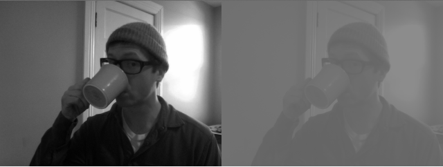

Maps the pixels of an image to the min and max range passed in.

```cpp

colors.setFromPixels(grabber.getPixels());

first = colors; // will leave unaltered
second = colors; // change it
second.convertToRange(100, 140); // super low contrast

```


