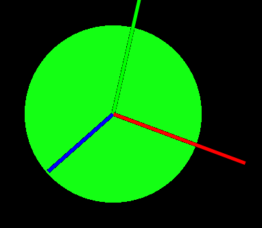

ofLight is an openGL light for 3D rendering.  It contains four main lighting types:

**Spot light** : Light originates from a single point and spreads outward in a cone of variable diameter and length

**Point light** : Light comes from a single point and spreads outward evenly in all directions

**Directional light** : Light comes evenly from a given direction, as if coming from a plan of infinite size and distance from the lit object

**Ambient light** : Light from a fixed intensity and fixed source that affects all objects equally


Within ofLight, the following properties of each light type can be set individually:

XYZ orientation

XYZ position

RGB color

Light attenuation / falloff

Additionally, spot lights have variable control of cone length and diameter.


*Spotlight with yellow diffuse reflection, narrow cone*


*Spotlight with yellow diffuse reflection, wide cone*

**ofLight and ofMaterial**

GL lighting effects are dependent on both the light and the material being lit.  ofLight interacts strongly with ofMaterial, which has five rendering parameters for materials being lit:

**Specular color** : the color of highlights on a material

**Diffuse color** : the color of the material when it is illuminated


*Point light with blue specular reflection and red diffuse reflection*

**Ambient color** : the color of the material when it is not illuminated


*Spotlight with red diffuse reflection, no specular reflection, and blue ambient color*

**Emissive color** : the color the material illuminated from within



*Emissive green material coloring, no external lights*

**Shininess** : the matte or shiny property of the material, which impacts how much specular light vs diffuse light reflects from a surface.


*Point light with yellow diffuse and blue specular reflections, high matte*


*Point light with yellow diffuse and blue specular reflections, high shine*

**ofLight and cameras**

If an ofLight is drawn within the context of a camera such as ofEasyCam, its position and orientation will be controlled by the camera and it will be oriented relative to the scene focus of the camera.

```cpp
camera.begin();
//spotlight is drawn in the camera frame and oriented relative to the focus of the camera
spotlight.enable(); 
ofSphere(0,0,0,100);
spotlight.disable();
camera.end();
```

If an ofLight is drawn outside the camera, it will be drawn in the global frame and will affect all objects in the scene equally.

```cpp
spotlight.enable(); //spotlight is in the global frame and not the camera frame
camera.begin();
ofSphere(0,0,0,100);
camera.end();
spotlight.disable();
```

(Examples made using LightsCamera example by Pete Werner https://github.com/petewerner/generative/tree/master/lights_camera)
