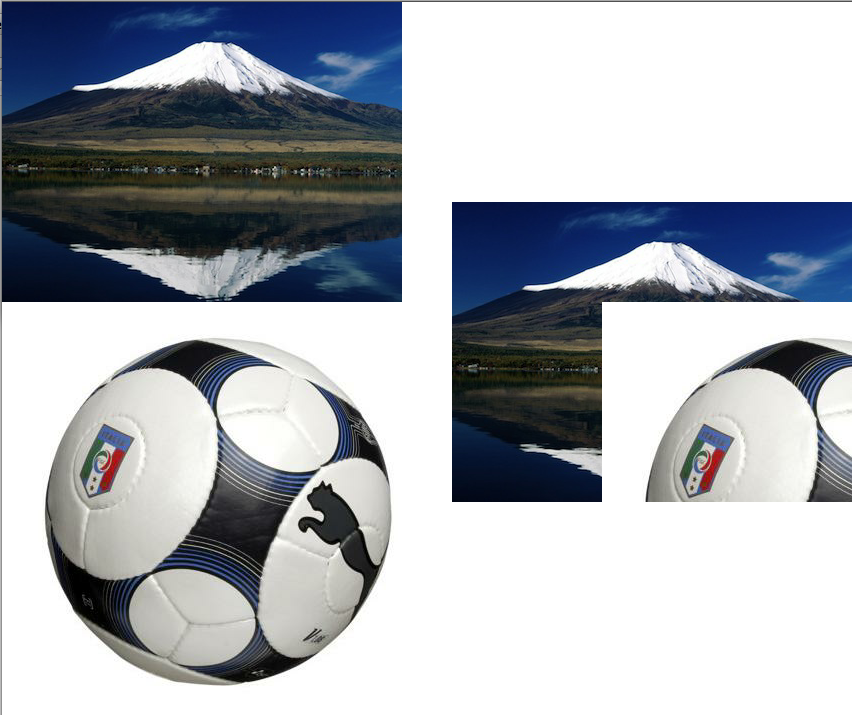

This pastes the ofPixels object into another ofPixels object at the specified index, copying data from the ofPixels that the method is being called on to the ofPixels object at &dst. If the data being copied doesn't fit into the dst then the image is cropped.
```cpp
ofLoadImage(footballPixels, "two.jpg");
ofLoadImage(fujiPixels, "one.jpg");
fujiTex.loadData(footballPixels);
footballTex.loadData(fujiPixels);
footballPixels.pasteInto(fujiPixels, 150, 100); // now fujiPixels is altered
mixtureTex.loadData(fujiPixels);
```
Drawing the three textures here you can see the ball cropped into the mountain:

