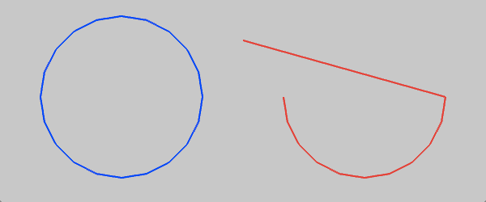

Draws an arc around the ofPoint ``center`` with the width of ``radiusX`` and the height of ``radiusY``.
The ``angleBegin`` and ``angleEnd`` indicate the start and end angles of the arc in degrees measured clockwise from the x-axis.
The ``clockwise`` boolean sets the drawing direction.  Passing 'false' to it will draw the arc counter-clockwise.

Optionally, you can specify ``circleResolution``, which is the number of line segments a circle would be drawn with.

