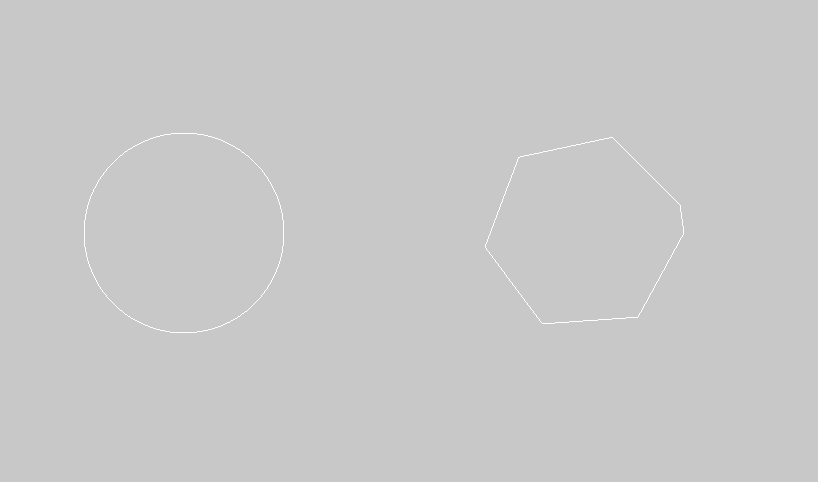

This resamples the line based on the spacing passed in. The larger the spacing, the more points will be eliminated.
```cpp
line.draw();
ofTranslate(400, 0);
line.getResampledBySpacing(100).draw();
```

