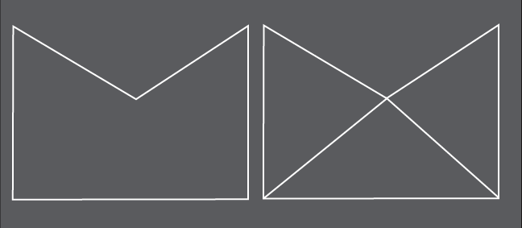

ofTessellator exists for one purpose: to turn ofPolylines into ofMeshes so that they can be more efficiently displayed using OpenGL. The ofPath class uses tessellation to turn its paths into openGL-ready shapes under the hood, so if you're interested in just having ofPolyline instances converted to meshes, it's handled for you by ofPath. If you're interested in using the tessellation multiple polylines at a time, then you'll find what you need in the ofTessellator. Many shapes can't be drawn by OpenGL without tessellation, but by breaking them into triangles or quads, they can be drawn easily, for instance:

The fairly simple shape shown on the left needs to be broken into triangles to be displayed, an example of how this might be done is shown on the right.

