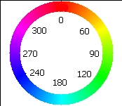

The hue field in setHsb() and in setHue() represents hue as a range between 0 and 
255 because the hue value has a range that matches the base data type, 
setHueAngle() sets hue using the conventional way to represent hue: with the 
range between 0 and 360.

